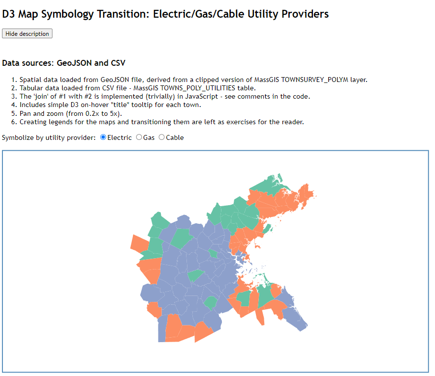

# d3-map-symbology-transition
Demo illustrating how to transition symbology in a d3.js map

This demo app makes use of the following external resources loaded from a CDN:
* jQuery version 1.12.4
* D3 version 6.3.1



## Internals
Execution is 'kicked-off' by this piece of code in the index.html file:
```
	$(document).ready(function() {
		initialize();	
	});	
```
Here, we use the jQuery library to notify us when the document's __ready__ event has fired.
This event is fired by the browser when  the HTML document has been completely parsed; 
it doesn't wait for other things like images, subframes, and async scripts to finish loading.
See this [MDN page](https://developer.mozilla.org/en-US/docs/Web/API/Window/DOMContentLoaded_event) for full details.
When this event fires, the code snippet listed above calls our __initialize__ function.

The __initialize__ function first has some code that exposes or hides the #blurb \<div\> \(which contains
some documentaiton the app and the data sources it uses\) based on a click to the #showhide button.

Next, the __initialize__ function loads the GeoJSON file containing the geographic data for the Boston
Reion MPO towns, and a CSV file contaiing informaiton on which utilities serve each town:
```
	d3.json("../DATA/ctps_brmpo_towns.geo.json")
		.then(function(mpoFeatureCollection) {
			d3.csv("../DATA/towns_poly_utilities.csv")
				.then(function(maTownsUtils) {
					generateViz(mpoFeatureCollection, maTownsUtils);
			});
		});
```
It uses d3's __d3.json__ and __d3.csv__ to load these two data sources, respectively.
When both data sources have been loaded successfully, it calls the __generateViz__ function.

The generateViz function is organized as follows:
1. An event handler is defined to respond to __change__ events on the set of radio buttons with the name __util\_choice__.
   When a given radio button is clicked, the function to render the correspoinding data (electric utility provider,
   gas utility provider, and cable TV provider) is called.
2. The array \('table'\) into which the CSV file containing information on utility providers by town
   is sorted on the __TOWN\_ID__ field, so it can later be joined with the geographic data.
3. Code to define the SVG container for the entire visuzliation.
4. Code to define a geographic projection for our spatial data, and create a geoPath generator function for it.
5. Code to handle panning and zooming; this include code that creates an invisible SVG \<rect\> which will be 
   used to catch pan/zoom events.
6. Code to create the SVG \<path\>s for the visualization, and to intially symbolize it on elecric utility provider.   
7. Functions to symbolize the map on electric utility provider, gas utility provider, and cable TV provider,
   called from the event handler, \(1\). 
