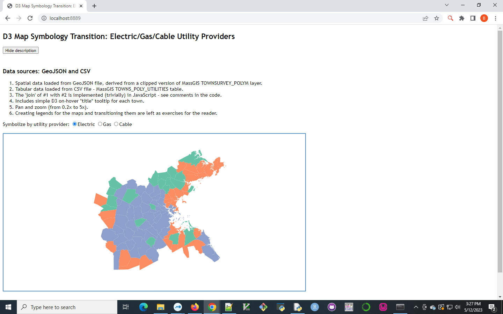

# d3-map-symbology-transition
Demo illustrating how to transition symbology in a d3.js map

This demo app makes use of the following external resources loaded from a CDN:
* jQuery version 1.12.4
* D3 version 6.3.1

